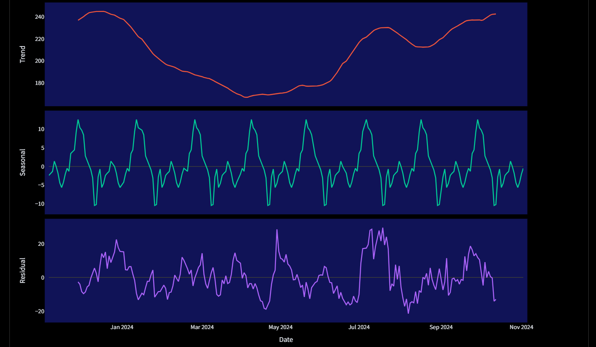
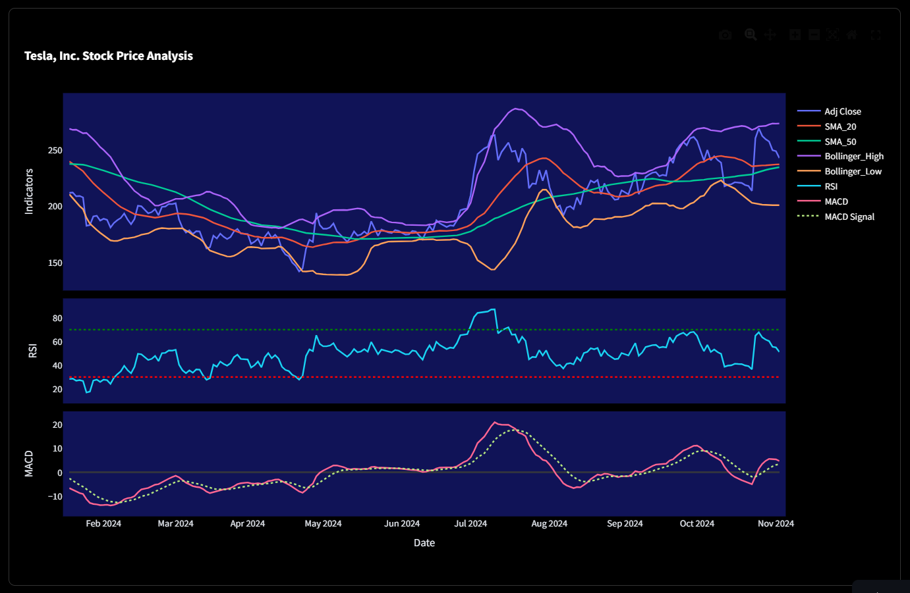
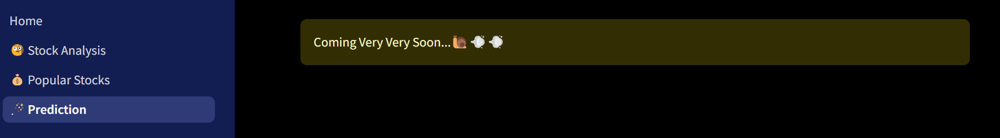

# Stock Price Analysis App

I am trying to analyse the historical stock market data available from `yfinance` library.

## Data Source

 - `yfinance` library
 - `Yahoo Finance` for web scraping

## Libraries
- `numpy`
- `pandas`
- `yfinance`
- `bs4`
- `plotly`
- `statsmodels`
- `ta`
- `requests`
- `streamlit`

## Deployment

- Cloning the repository and installing necessary libraries is enough to run the code.
- Maintaining the heirarcy of the files is important.

```bash
  streamlit run Home.py
```
## Page 1 : 🧐 Stock Analysis


On this page, you can dive into any stock's history by entering a `ticker`, `start date`, and `end date`.

Instead of pulling data for each date range separately, we grab the stock's entire historical data just once from yfinance. This way, you can easily explore different time periods for the same stock without making repeated requests—making the app faster and easier to use!


### 1. Candle stick plot:
On this page, we display the latest recorded **Closing Price**, **High**, **Low**, and **Volume** for quick insights. The candlestick plot showcases price movements, with reference lines marking the **Highest High**, **Lowest Low**, and **Previous Close Price** to highlight key levels.


### 2. Decomposition:

Here, we're breaking down the time series into its key components: **trend**, **seasonal**, and **residual**. You can choose between **Additive** or **Multiplicative** decomposition, and watch as each component is plotted to reveal underlying patterns in the data.



### 3. Indicators:
Welcome to the Indicators page! Here, you can select and overlay multiple features—including **Adjusted Close**, **Close**, **Open**, **High**, **Low**, and multiple indicators—**SMA20**, **SMA50**, **EMA20**, **EMA50**, and **Bollinger Bands**—all on a single plot. This setup allows you to visually analyze various trends and signals in the stock's performance for deeper insights.



## Page 2 : 💰 Popular Stocks

The Popular Stocks page! Choose from categories like **Most Active**, **Trending Now**, **Top Gainers**, or **Top Losers** to view real-time data on price movements for the top 6 stocks in each category. The app fetches this data from Yahoo Finance, so you get the latest market movers at a glance."


## Page 3 : 🪄 Predictions

Work in-prgress!!! Stay tuned!!!



## Final Thoughts


The Streamlit web app is currently not very mobile-friendly. I welcome any feedback on bugs and suggestions for improvement. Additionally, I am interested in exploring techniques for predicting stock prices, as I aim to develop a model that can train directly within the app and potentially perform hyperparameter tuning.

